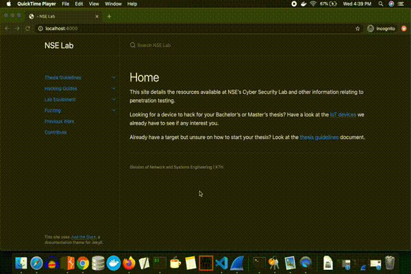
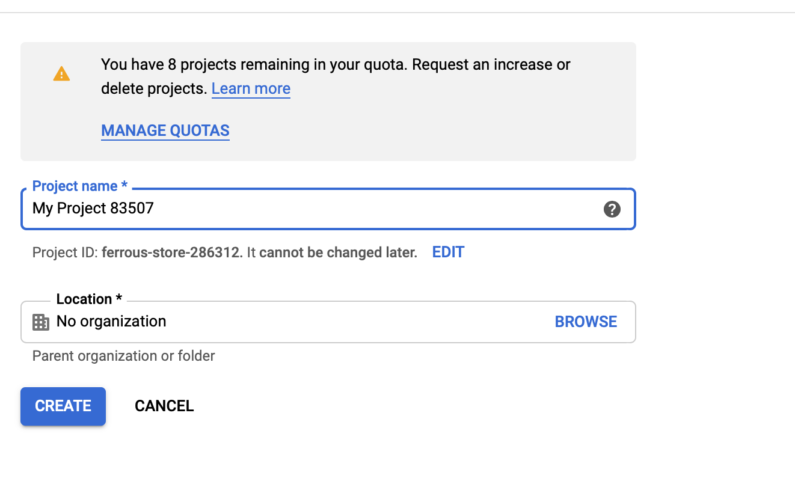
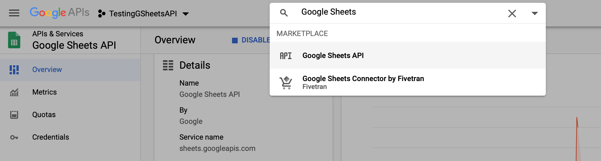
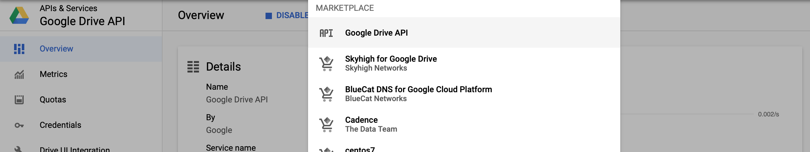
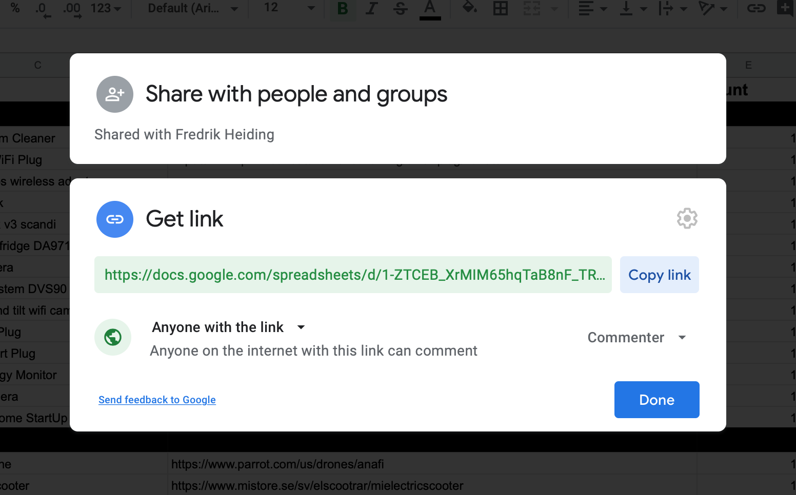
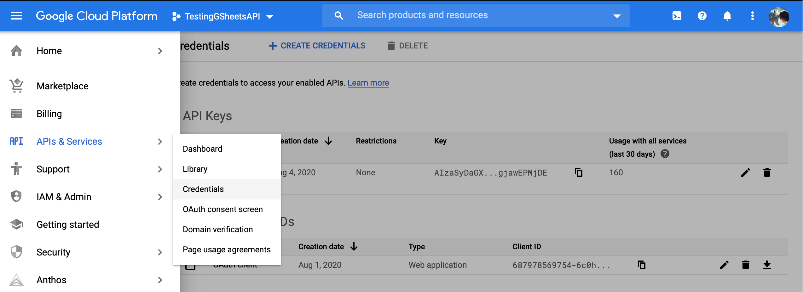
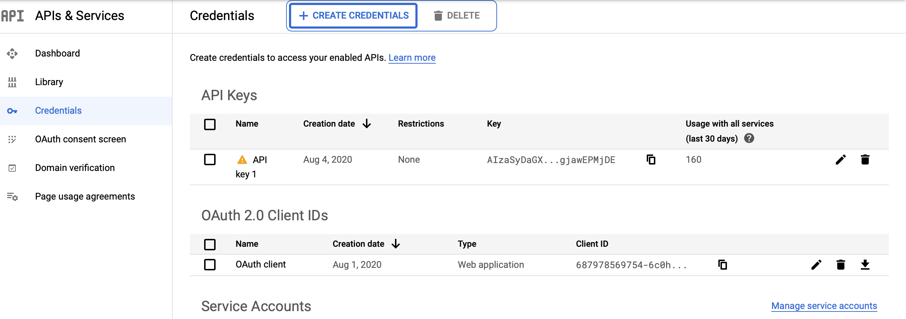
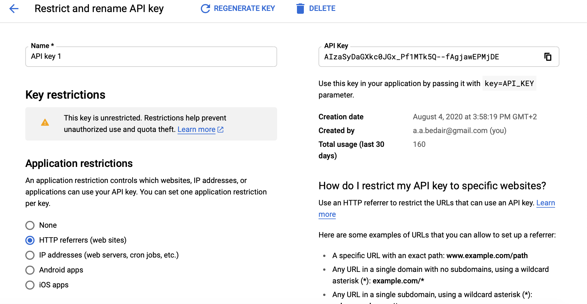
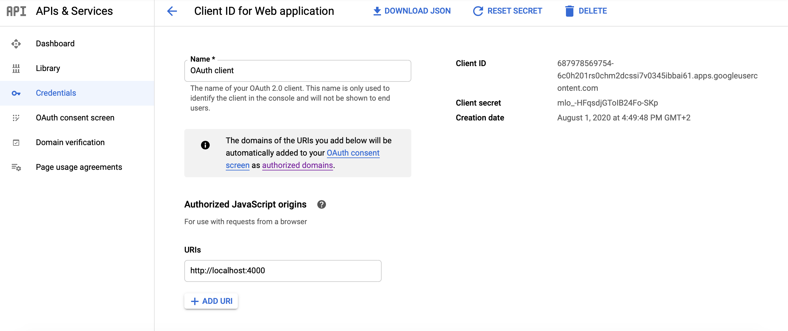

# Documentation for NSE Lab

The `/docs` folder contains the contents of the website
[nse.digital](http://nse.digital). Markdown files in `/docs` are automatically
generated as HTML files on the website. The home page of the website is
`/docs/README.md`. The website uses the Jekyll theme
[Just The Docs](https://pmarsceill.github.io/just-the-docs/). It should be quite
clear from looking through the `/docs` folder how the site works and is
structured, but
[this](https://pmarsceill.github.io/just-the-docs/docs/navigation-structure/)
page in the Just The Docs documentation should help explain things in detail.

## Contributing

If you want to contribute to the documentation on the website please make a pull
request. You can contact [Pontus](https://github.com/pontusj101) to review your pull request.

## Local development
In the `/docs` directory, run the following commands:

```
sudo gem install jekyll bundler
bundle exec jekyll serve
```

### Docker
In this directory do the following commands:

```
sudo docker build -t work_web .
docker run -p 4000:4000 -ti --rm --name work_web_container work_web
```

The server is now accessible at http://localhost:4000/

## Requirements for Google Sheets Integration
This feature allows to fetch available lab equipment from google sheets. It also allows students to book the equipment by automatically posting a comment on the sheet for the required device. The following gif, showcases the final feature in action. 
- A google project is required for integrating this feature. 
- Enable Google Sheets Api and Google Drive api to this project.
- You need a google sheet, ideally with shared link where anyone can comment. 
- Finally you need a client-id and an api key. To get these, refer to the IAM tab in the google cloud console. 

Note that for the last step, it is recommended to set restrictions on the api key, and to set the allowed origin from the client.  


Adjusting quotas is advised for further control.

